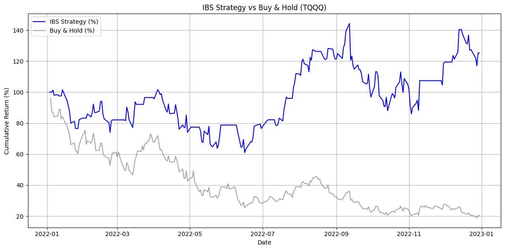

# IBS Strategy on Leveraged ETF Tickers

This project applies the **Internal Bar Strength (IBS)** strategy to historical ticker data downloaded using the `yfinance` library. The strategy is implemented and analyzed in a Google Colab environment. This strategy is based on [u/heygentlewhale's post on Reddit](https://www.reddit.com/r/TQQQ/comments/1l63i0i/tqqq_internal_bar_strength_strategy_that_made_me/?utm_source=share&utm_medium=web3x&utm_name=web3xcss&utm_term=1&utm_content=share_button).

## Overview

The IBS strategy is a mean-reversion trading method that evaluates the relative position of the closing price within the daily range of a security. It is defined as:

IBS = (Close - Low) / (High - Low)

Low IBS values (close to 0) may signal oversold conditions, while high IBS values (close to 1) may suggest overbought conditions.

This strategy is robust. Backtesting from 2022/01/01 to 2023/01/01 during market downturn shows significant outperformance.

## Data Source

All data is fetched via the [`yfinance`](https://github.com/ranaroussi/yfinance) Python library, which provides easy access to historical market data from Yahoo Finance.

## Key Tickers

The strategy is specifically tested on **high-volatility, leveraged ETFs**, which tend to exhibit stronger mean-reverting behavior. The primary tickers analyzed in this project are:

- **TQQQ**: ProShares UltraPro QQQ (3x leveraged NASDAQ-100)
- **SPXL**: Direxion Daily S&P 500 Bull 3X Shares

## Key Features

- Automated data download using `yfinance`
- Computation of IBS values and backtesting of entry/exit rules
- Performance metrics including Total Returns, Sharpe Ratio, Max Drawdown, and Win Rate
- Flexible parameter tuning for optimizing the strategy
- Real-time Buy/Sell signal on any ticker, track past recent signals via plot 

## ⚠️ Disclaimer

This project is for educational and research purposes only. Trading involves significant risk and past performance does not guarantee future returns.

The publication is not intended to be and do not constitute financial advice, investment advice, trading advice or any other advice or recommendation of any sort. The publisher also does not warrant that the publication is accurate, up to date or applicable to the circumstances of any particular case.

---

Feel free to fork, modify, and test this strategy on your own selected tickers 
