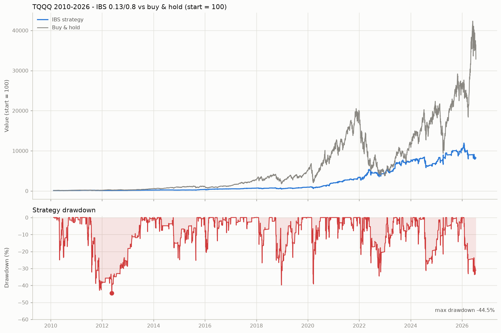
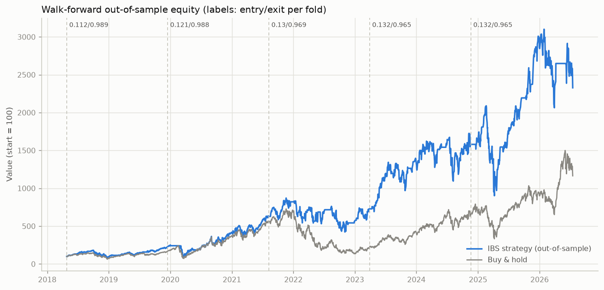
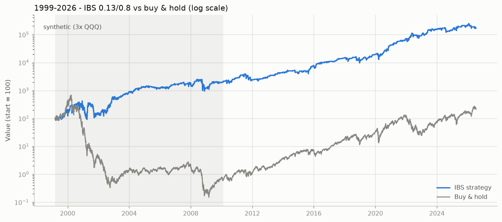

# IBS Strategy on Leveraged ETF Tickers

This project applies the **Internal Bar Strength (IBS)** mean-reversion strategy to daily ticker data from Yahoo Finance. It is based on [u/heygentlewhale's post on Reddit](https://www.reddit.com/r/TQQQ/comments/1l63i0i/tqqq_internal_bar_strength_strategy_that_made_me/?utm_source=share&utm_medium=web3x&utm_name=web3xcss&utm_term=1&utm_content=share_button).

The repo is a small, tested Python package with a backtesting engine, threshold optimization, **purged walk-forward validation**, signal visualization, and a live-signal command that opens an **interactive candlestick chart** of the past year's trades. The original notebook is kept at the repo root and still runs in Colab:

[](https://github.com/CazSyd/IBS-Strategy/actions/workflows/ci.yml) [](https://colab.research.google.com/github/CazSyd/IBS-Strategy/blob/main/IBS_strategy.ipynb)

**Live signal page: <https://cazsyd.github.io/IBS-Strategy/>** - interactive TQQQ & SPXL charts, rebuilt every weekday after the US close.

## The strategy

IBS measures where a bar closes within its daily range:

```
IBS = (Close - Low) / (High - Low)
```

Values near 0 mean the close sat at the low of the day (oversold), values near 1 at the high (overbought). The strategy is long-only on daily bars:

- **Entry** - if flat and _yesterday's_ IBS < entry threshold (default **0.132**), buy at _today's open_, all-in with whole shares.
- **Exit** - if long and _yesterday's_ IBS > exit threshold (default **0.965**), sell at _today's open_.
- Equity is marked to market at each close. No commissions or slippage are modeled.

The default thresholds are the CAGR-optimal pair over TQQQ's full listing history (2010-2026, see the results snapshot below); pass `--entry`/`--exit` (or the function arguments) to try others, e.g. the notebook's original 0.19/0.95.

Signals always come from the previous completed bar, so there is no look-ahead. Mean reversion of this kind works best on high-volatility leveraged ETFs such as **TQQQ** and **SPXL**.

## Getting started

The project is managed with [uv](https://docs.astral.sh/uv/) (`pyproject.toml` + `uv.lock` replace the old `requirements.txt`):

```bash
uv sync              # creates .venv and installs everything
uv run ibs --help    # the CLI
uv run pytest        # run the test suite
```

To open the notebook locally instead of Colab: `uv sync --group notebook && uv run jupyter lab`.

## CLI

```bash
# Backtest the default thresholds: metrics + trades/equity/drawdown chart
uv run ibs backtest TQQQ

# In-sample grid search over entry x exit thresholds, with a heatmap
uv run ibs optimize TQQQ --objective cagr

# Purged walk-forward validation: re-optimize per fold, evaluate out-of-sample
uv run ibs walkforward TQQQ --folds 5 --purge 5 --objective cagr

# Live signal (BUY / SELL / HOLD) + interactive candlestick page of recent trades
uv run ibs signal TQQQ
```

History defaults to the ticker's **full listing period** (TQQQ: 2010); narrow it with `--start`/`--end`. `backtest`/`optimize`/`walkforward` render matplotlib charts, while `signal` builds a self-contained interactive HTML page (Plotly) and opens it in your browser: daily candlesticks and volume for the past year (`--lookback` to change), every entry/exit fill marked with labeled B/S triangles, dashed guide lines and shaded holding spans, 1M/3M/6M/All range buttons that refit the price and volume axes to the window, hover showing the day's OHLC, IBS, volume, and change, plus a light/dark theme toggle that follows your OS preference and remembers your choice. The page is built for phones too: full-viewport layout, finger-sized controls, adaptive tick labels, and a 3-month opening window instead of an unreadable year of candles. All commands accept `--save DIR` (write files instead of opening anything) and `--no-plot`. Objectives for `optimize`/`walkforward`: `total_return` (default, Sharpe tiebreak - same ranking as the notebook), `cagr`, `sharpe`, `max_drawdown`, `win_rate`. Note that over a fixed window CAGR and total return rank thresholds identically; CAGR is the right number for comparing _across_ windows of different lengths.

The default grids sweep entry over (0, 0.20] and exit over [0.80, 1.0) in **0.001 steps** - 40,000 pairs, scanned in under half a minute by a vectorized replay of the backtest engine (identical results to `run_backtest`, verified by tests). Coarser or narrower searches via `--entry-grid`/`--exit-grid A:B:STEP`. Finer grids fit noise more easily, so judge candidates by their walk-forward showing, not the in-sample leaderboard.

`--extend QQQ` prepends **synthetic pre-listing history** so TQQQ runs can start in 1999-03 instead of 2010-02 (see the methodology below); `--leverage` sets the synthetic daily leverage (default 3).

## Python API

```python
from ibs_strategy import load_data, run_backtest, grid_search, walk_forward, plot_backtest

data = load_data("TQQQ")  # full listing history; pass start/end to narrow

result = run_backtest(data)      # defaults: entry 0.13 / exit 0.97
print(result.summary())          # sharpe, total_return, cagr, max_drawdown, win_rate, ...
plot_backtest(result, ticker="TQQQ")

ranked = grid_search(data)       # every (entry, exit) pair, best row first
wf = walk_forward(data, n_folds=5, purge_days=5)
print(wf.summary())              # stitched out-of-sample metrics
```

## Methodology

### Backtest engine

`run_backtest` is a faithful port of the notebook's event-driven loop: previous-bar IBS signal, next-open fill, all-in whole-share sizing (leftover cash stays uninvested), one position at a time, strict threshold comparisons. Bars where `High == Low` have undefined IBS and never signal.

### Metrics (as defined in the notebook)

| Metric       | Definition                                                                               |
| ------------ | ---------------------------------------------------------------------------------------- |
| Sharpe ratio | `mean(daily returns) / std(ddof=1) * sqrt(252)`, zero risk-free rate, flat days included |
| Total return | `final capital / initial capital - 1`                                                    |
| Max drawdown | deepest peak-to-trough decline of the equity curve                                       |
| Win rate     | share of _closed_ trades whose exit fill beat the entry fill                             |

The package additionally reports CAGR, time-in-market, trade count, and final capital.

### Purged walk-forward validation

The notebook picked its "ideal" thresholds by optimizing over the whole backtest period - an in-sample estimate that flatters results. `walk_forward` addresses that:

1. The first `min_train_frac` (default 50%) of the history seeds the training window; the rest is split into `n_folds` sequential test windows.
2. For each fold, the threshold grid is re-optimized on all data _before_ the test window, minus a `purge_days` gap (default 5 trading days) so boundary fills and still-open positions can't leak information across the split.
3. The chosen thresholds are evaluated once on the unseen test window (starting flat), and the per-fold equity segments are compounded into a single out-of-sample curve.

### Synthetic pre-listing history (1999+)

TQQQ only lists from 2010-02, so its real history misses the dot-com crash. `--extend QQQ` (API: `load_extended_data`) prepends synthetic 3x bars derived from QQQ, which trades since 1999-03-10 - Yahoo's single `QQQ` symbol also covers its Amex and QQQQ-era listings:

- A daily-rebalanced fund resets leverage at each close, so every intraday price relative to the previous close moves at `leverage` times the proxy's. Open/high/low/close therefore map through one affine transform per bar, and **IBS - hence every signal - is exactly the proxy's**: pre-2010 the strategy is trading QQQ's IBS at 3x.
- Daily costs: 0.95%/yr expense ratio plus **financing of the borrowed 2x exposure** at the 13-week T-bill yield (`^IRX`) + a 0.5%/yr swap spread, deducted uniformly across each bar. The spread is calibrated on the 2010-2026 overlap, where the model tracks real TQQQ to **+0.07%/yr CAGR drift at 0.9989 daily-return correlation**; skipping the financing leg (as naive 3x reconstructions do) would overshoot by ~5.7%/yr.
- The path is scaled so the seam overnight move into the first real bar equals the modeled 3x proxy move, and a boolean `Synthetic` column marks reconstructed bars.

Caveats: the synthetic era has no tracking error, spreads, or intraday-rebalancing effects, and its volume is the proxy's. It informs regime analysis; the package defaults stay tuned on real listing history.

### Results snapshot (TQQQ, full listing history 2010-02 to 2026-07, checked July 2026)

Default thresholds **entry 0.132 / exit 0.965** - the whole-period CAGR optimum from the 0.001-step grid search (the top cells form a coherent plateau around entry 0.130-0.132 / exit 0.964-0.969, not a lone spike):

| Metric                     | IBS 0.132 / 0.965 (default) | IBS 0.133 / 0.802 (crash-aware) | Buy & hold |
| -------------------------- | --------------------------- | ------------------------------- | ---------- |
| CAGR                       | **60.3%**                   | 32.1%                           | 42.3%      |
| Total return               | +231,912%                   | +9,563%                         | +32,748%   |
| Sharpe ratio               | 1.19                        | 0.93                            | 0.89       |
| Max drawdown               | -56.8%                      | -44.5%                          | -81.7%     |
| Win rate                   | 74.6% (177 closed trades)   | 67.8% (354)                     | -          |
| Time in market             | 62.2%                       | 26.3%                           | 100%       |
| Final capital ($10k start) | $23.20M                     | $0.97M                          | $3.28M     |



- **Purged walk-forward, out-of-sample 2018-04 to 2026-07** (0.001 grid re-optimized per fold): 46.6% CAGR vs 34.8% for buy & hold (Sharpe 0.93, max drawdown -61.8%). The two most recent folds independently choose exactly entry 0.132 / exit 0.965, agreeing with the default, and the strategy sat roughly flat through the 2022 bear while buy & hold collapsed.
- Engine parity: over the original notebook's window (2020-01 to 2025-07) with its 0.19/0.95 thresholds, the engine reproduces the notebook's reported numbers (Sharpe 1.286 vs 1.283, max drawdown -46.48% vs -46.47%) up to Yahoo's adjusted-price revisions.



Caveat: the headline row is still fitted in-sample and no commissions or slippage are modeled - the walk-forward row is the fairer performance estimate.

**Extended to 1999 with synthetic data** (`ibs ... --extend QQQ`; context, not the defaults):

- At the default 0.132/0.965 thresholds, 1999-03 to 2026-07 gives 23.0% CAGR vs 2.8% for buy & hold (a 3x hold is nearly wiped out in 2000-2002) - but with a **-99.2% max drawdown**: the 2010-era patient exit is unlivable through a 3x crash regime.
- The 1999+ whole-period CAGR optimum flips the exit to "sell the first bounce": **entry 0.133 / exit 0.802** (full metrics in the table below). The ~0.13 entry reappears in every regime tested; the exit threshold is the regime-sensitive knob.
- Walk-forward with training anchored at 1999 (out-of-sample 2012-11 to 2026-07, all real bars): **32.4% CAGR, Sharpe 0.93, -39.9% max drawdown at just 27% time in market**. Far safer than buy & hold, though trailing its 43.8% CAGR through a crash-free bull era - the crash-taught exits keep paying for insurance the period never needed.

Full metrics over the extended history (1999-03 to 2026-07, synthetic + real bars):

| Metric                     | IBS 0.133 / 0.802 (1999+ optimum) | IBS 0.132 / 0.965 (default) | Buy & hold |
| -------------------------- | --------------------------------- | --------------------------- | ---------- |
| CAGR                       | **31.7%**                         | 23.0%                       | 2.8%       |
| Total return               | +186,310%                         | +28,762%                    | +111%      |
| Sharpe ratio               | 0.77                              | 0.65                        | 0.44       |
| Max drawdown               | -78.5%                            | -99.2%                      | -99.98%    |
| Win rate                   | 65.4% (635 closed trades)         | 68.7% (294)                 | -          |
| Time in market             | 30.8%                             | 66.7%                       | 100%       |
| Final capital ($10k start) | $18.64M                           | $2.89M                      | $21.1k     |



Charts regenerate with `uv run python scripts/build_readme_charts.py`.

## CI & the hosted signal page

Two GitHub Actions workflows live in `.github/workflows/`:

- **`ci.yml`** - runs `uv sync --locked` + the pytest suite on every push and pull request.
- **`pages.yml`** - rebuilds the interactive signal pages (`scripts/build_site.py`, TQQQ + SPXL) and deploys them to GitHub Pages on every push to `main` and on a weekday schedule (21:30 UTC, after the 4pm ET close), so the hosted page always shows the latest completed session:

**Live signals: <https://cazsyd.github.io/IBS-Strategy/>**

One-time setup after pushing: in the repo's **Settings → Pages**, set **Source** to **GitHub Actions**.

## Project layout

```
├── IBS_strategy.ipynb        # original Colab notebook (kept as-is)
├── pyproject.toml            # uv-managed project + dependencies
├── uv.lock                   # locked environment
├── .github/workflows/        # CI (tests) + GitHub Pages deploy
├── scripts/build_site.py     # builds the hosted signal pages
├── src/ibs_strategy/
│   ├── data.py               # yfinance download + IBS computation
│   ├── backtest.py           # event-driven backtest engine
│   ├── metrics.py            # notebook metric definitions
│   ├── optimize.py           # grid search + purged walk-forward
│   ├── synthetic.py          # synthetic pre-listing history (3x QQQ back to 1999)
│   ├── visualize.py          # trades, equity, drawdown, heatmap, walk-forward charts
│   ├── live.py               # realtime BUY/SELL/HOLD signal check
│   ├── web.py                # interactive candlestick signal page (plotly)
│   └── cli.py                # `ibs` command
└── tests/                    # pytest suite (synthetic data, no network)
```

## Data source

All data is fetched via the [`yfinance`](https://github.com/ranaroussi/yfinance) library (auto-adjusted daily OHLCV).

## ⚠️ Disclaimer

This project is for educational and research purposes only. Trading involves significant risk and past performance does not guarantee future returns.

The publication is not intended to be and does not constitute financial advice, investment advice, trading advice or any other advice or recommendation of any sort. The publisher also does not warrant that the publication is accurate, up to date or applicable to the circumstances of any particular case.

---

Feel free to fork, modify, and test this strategy on your own selected tickers
