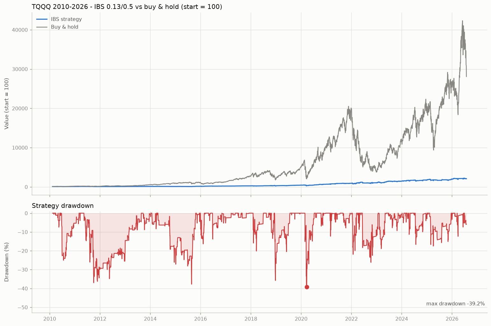
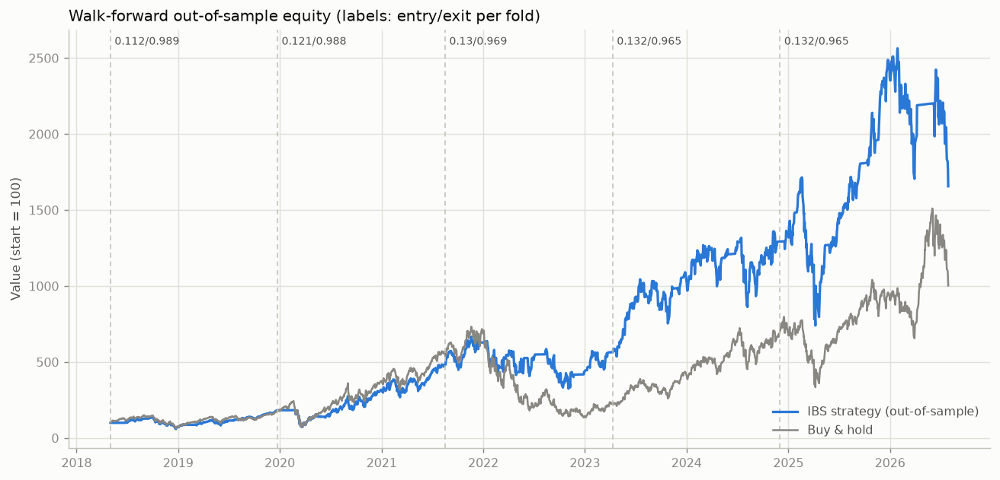
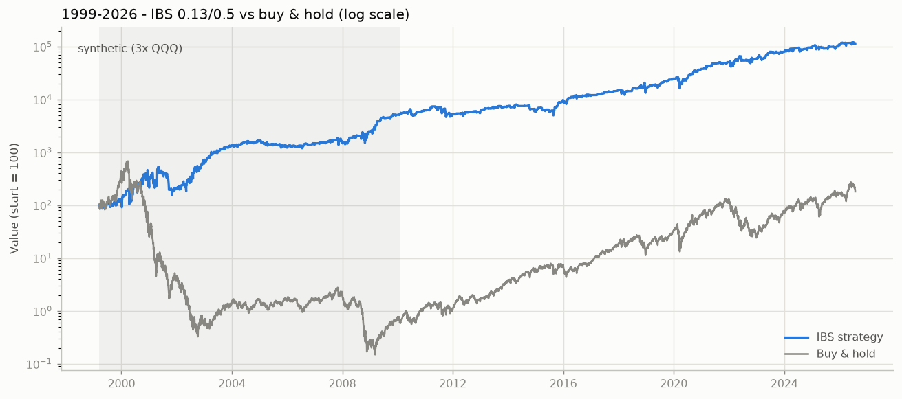

# IBS Strategy on Leveraged ETF Tickers

This project applies the **Internal Bar Strength (IBS)** mean-reversion strategy to daily ticker data from Yahoo Finance. It is based on [u/heygentlewhale's post on Reddit](https://www.reddit.com/r/TQQQ/comments/1l63i0i/tqqq_internal_bar_strength_strategy_that_made_me/?utm_source=share&utm_medium=web3x&utm_name=web3xcss&utm_term=1&utm_content=share_button).

The repo is a small, tested Python package with a backtesting engine, threshold optimization, **purged walk-forward validation**, signal visualization, and a live-signal command that opens an **interactive candlestick chart** of the past year's trades. The original notebook is kept at the repo root and still runs in Colab:

[](https://github.com/CazSyd/IBS-Strategy/actions/workflows/ci.yml) [](https://colab.research.google.com/github/CazSyd/IBS-Strategy/blob/main/IBS_strategy.ipynb)

**Live signal page: <https://cazsyd.github.io/IBS-Strategy/>** - interactive TQQQ & SPXL charts, rebuilt every weekday after the US close.

## The strategy

IBS measures where a bar closes within its daily range:

```
IBS = (Close - Low) / (High - Low)
```

Values near 0 mean the close sat at the low of the day (oversold), values near 1 at the high (overbought). The strategy is long-only on daily bars:

- **Entry** - if flat and _yesterday's_ IBS < entry threshold (default **0.13**), buy at _today's open_, all-in with whole shares.
- **Exit** - if long and _yesterday's_ IBS > exit threshold (default **0.5**), sell at _today's open_.
- Equity is marked to market at each close. Idle cash earns the 13-week T-bill; no commissions or slippage are modeled.

The defaults are round on purpose, and they are **not** the output of an optimizer. Entry 0.13 fires on the bottom ~12% of days, which is where [essentially all of the measured edge lives](#does-the-signal-actually-predict-anything). Exit 0.5 is a prompt, zero-degrees-of-freedom exit at the neutral midpoint - sell once a bar closes in the upper half of its range: the IBS edge is _front-loaded_ (largely spent within a day, gone within three), so a prompt exit harvests it and steps aside, which keeps the strategy in cash ~80% of the time and truncates crashes. An _optimized_ exit cannot be justified - the threshold surface [does not replicate out-of-sample](#why-the-thresholds-are-not-optimized), and a stop loss makes a mean-reversion system worse rather than better (it sells exactly when the expected bounce is largest). Optimizing purely on the crash-free 2010+ window instead picks a patient 0.965 exit, which earns far more in a bull run and draws down 99% through 2000-2002. The 200-day-SMA overlay does not help either - [it removes the edge, not the risk](#where-the-edge-lives-below-the-200-day-sma). Pass `--entry`/`--exit` to use any other pair, e.g. the notebook's original 0.19/0.95.

Signals always come from the previous completed bar, so there is no look-ahead. Mean reversion of this kind works best on high-volatility leveraged ETFs such as **TQQQ** and **SPXL**.

## Getting started

The project is managed with [uv](https://docs.astral.sh/uv/) (`pyproject.toml` + `uv.lock` replace the old `requirements.txt`):

```bash
uv sync              # creates .venv and installs everything
uv run ibs --help    # the CLI
uv run pytest        # run the test suite
```

To open the notebook locally instead of Colab: `uv sync --group notebook && uv run jupyter lab`.

## CLI

```bash
# Backtest the default thresholds: metrics + trades/equity/drawdown chart
uv run ibs backtest TQQQ

# In-sample grid search over entry x exit thresholds, with a heatmap
uv run ibs optimize TQQQ --objective cagr

# Purged walk-forward validation: re-optimize per fold, evaluate out-of-sample
uv run ibs walkforward TQQQ --folds 5 --purge 5 --objective cagr

# Live signal (BUY / SELL / HOLD) + interactive candlestick page of recent trades
uv run ibs signal TQQQ
```

History defaults to the ticker's **full listing period** (TQQQ: 2010); narrow it with `--start`/`--end`. `backtest`/`optimize`/`walkforward` render matplotlib charts, while `signal` builds a self-contained interactive HTML page (Plotly) and opens it in your browser: daily candlesticks and volume for the past year (`--lookback` to change), every entry/exit fill marked with labeled B/S triangles, dashed guide lines and shaded holding spans, 1M/3M/6M/All range buttons that refit the price and volume axes to the window, hover showing the day's OHLC, IBS, volume, and change, plus a light/dark theme toggle that follows your OS preference and remembers your choice. The page is built for phones too: full-viewport layout, finger-sized controls, adaptive tick labels, and a 3-month opening window instead of an unreadable year of candles. All commands accept `--save DIR` (write files instead of opening anything) and `--no-plot`. Objectives for `optimize`/`walkforward`: `total_return` (default, Sharpe tiebreak - same ranking as the notebook), `cagr`, `sharpe`, `max_drawdown`, `win_rate`. Note that over a fixed window CAGR and total return rank thresholds identically; CAGR is the right number for comparing _across_ windows of different lengths.

The default grids sweep entry over (0, 0.20] and exit over [0.80, 1.0) in **0.001 steps** - 40,000 pairs, scanned in under half a minute by a vectorized replay of the backtest engine (identical results to `run_backtest`, verified by tests). Coarser or narrower searches via `--entry-grid`/`--exit-grid A:B:STEP`. Finer grids fit noise more easily, so judge candidates by their walk-forward showing, not the in-sample leaderboard.

`--extend QQQ` prepends **synthetic pre-listing history** so TQQQ runs can start in 1999-03 instead of 2010-02 (see the methodology below); `--leverage` sets the synthetic daily leverage (default 3).

## Python API

```python
from ibs_strategy import load_data, run_backtest, grid_search, walk_forward, plot_backtest

data = load_data("TQQQ")  # full listing history; pass start/end to narrow

result = run_backtest(data)      # defaults: entry 0.13 / exit 0.5
print(result.summary())          # sharpe, total_return, cagr, max_drawdown, win_rate, ...
plot_backtest(result, ticker="TQQQ")

ranked = grid_search(data)       # every (entry, exit) pair, best row first
wf = walk_forward(data, n_folds=5, purge_days=5)
print(wf.summary())              # stitched out-of-sample metrics
```

## Methodology

### Backtest engine

`run_backtest` is a faithful port of the notebook's event-driven loop: previous-bar IBS signal, next-open fill, all-in whole-share sizing (leftover cash stays uninvested), one position at a time, strict threshold comparisons. Bars where `High == Low` have undefined IBS and never signal.

**Idle cash earns interest.** The notebook implicitly paid 0% on cash, which quietly penalizes any setting that spends time flat - and the default exit sits in cash over 80% of the time. `--cash-rate` (default `^IRX`, the 13-week T-bill) accrues a real yield on the cash balance each bar, before that bar's fill, so a fully invested day earns none. Pass `--cash-rate 0` for the notebook's assumption. This matters most in the high-rate 1999-2007 stretch, where cash yielded 3-6.5%.

**Optional regime gate.** `run_backtest(..., regime=flags)` blocks entries while a boolean Series is off, and `regime_exit=True` additionally liquidates at the next open once it turns off - with the same previous-bar, no-look-ahead timing as the IBS signal. It exists to *test* overlays such as the 200-day SMA, which is how we learned that [the filter removes the edge rather than the risk](#where-the-edge-lives-below-the-200-day-sma). There is deliberately no CLI flag for it.

**Fill timing and the overnight edge.** `entry_fill`/`exit_fill` (default `"open"`; CLI `--entry-fill`/`--exit-fill`) choose whether a leg fills at the next bar's open or at the signal bar's own **close**. The motivation is real: the IBS reversion *begins overnight*. Bucketing every bar by IBS, the bottom-quintile close→next-open return is positive, significant (t 2.7-3.6), replicates across halves, and scales ~3x with leverage - additive to the intraday edge we already trade. Backtested, moving the entry to the close lifts TQQQ from **29.5% CAGR / 0.79 Sharpe to 41.1% / 0.95** (SPXL 22.4/0.82 → 28.2/0.92) at equal-or-better drawdown, and a close *exit* trades a little return for lower exposure and gap risk.

The catch is execution: a close entry fills in the closing auction, or a post-market print a few hours later, paying a bid/ask spread the liquid regular-hours open does not. Modelling that - miss a fraction of the overnight, plus a spread that is tight on normal signal days and wide only on genuine crash days - it never turns the strategy negative, and on a liquid name like **TQQQ the edge survives**: even charging 30-40 bp to the ~40% of signal days that close down hard (already an overcharge for TQQQ's overnight book) and single-digit bp to the rest, close entry still runs a few CAGR points ahead of the plain next-open entry at comparable Sharpe. The blended-slippage breakeven is ~22 bp. On less-liquid **SPXL the margin is thinner - roughly a wash** (breakeven ~13 bp), and the residual risk everywhere is the genuine crash leg, where the widest spread coincides with the worst overnight outcome. The default stays `"open"` for universal executability (the hosted signal pages assume it, and not everyone trades overnight), but close entry is a real, worthwhile option on a liquid instrument if you can transact near the close.

### Does the signal actually predict anything?

Grid searches answer "which parameters won on this sample". That turns out to be unanswerable (below), so the prior question has to be settled separately: does a low IBS predict a higher forward return _at all_? `decile_response` pools every bar instead of slicing by parameter - bucket days by IBS, then measure the return of the session a signal would have had you long (buy next open, mark at that close):

Reported by quintile (IBS < ~0.20 versus > ~0.80), because which _decile_ peaks is not stable - the effect crests in decile 1 on the S&P instruments and decile 2 on the Nasdaq ones, a distinction the data cannot support:

| Instrument | Bottom quintile (IBS < 0.20) | Top quintile | Rank corr | Split-half agreement |
| ---------- | ---------------------------- | ------------ | --------- | -------------------- |
| TQQQ (3x)  | **+0.395%** (t=2.75)         | -0.106%      | -0.83     | +0.43                |
| SPXL (3x)  | **+0.222%** (t=2.64)         | -0.100%      | -0.74     | **+0.79**            |
| QQQ (1x)   | +0.144% (t=3.02)             | -0.037%      | -0.83     | -                    |
| SPY (1x)   | +0.088% (t=3.05)             | -0.039%      | -0.70     | -                    |

Four properties make this credible where the threshold surface was not. The gradient runs the same direction on all four instruments (rank correlation -0.70 to -0.83). The leveraged versions earn **2.5-2.7x** their underlyings' edge - close to the 3x you would expect from a genuine price effect, and short of it by about the amount leveraged-fund costs and volatility decay should subtract. The effect is present in the plain underlyings, so it is not a leveraged-ETF artifact. And the shape of the curve **replicates across halves of the sample** (+0.43 and +0.79) where the Sharpe surface managed -0.07.

That is the evidence the strategy rests on, and it is what sets entry 0.13 - not an optimizer. The threshold sits inside the region carrying essentially all of the positive forward returns, and anywhere in roughly 0.10-0.20 would do as well.

```python
from ibs_strategy import decile_response, response_gradient, load_data

response = decile_response(load_data("TQQQ"))
print(response, response_gradient(response), sep="\n")
```

Caveats worth keeping attached. The effect lives almost entirely in the bottom quintile - the middle buckets are noise, so this is closer to an extreme-value effect than a smooth dose-response, and the rank correlations partly reflect that. Daily equity returns are fat-tailed enough to flatter t-statistics. The bottom decile on TQQQ is not individually significant (t=1.00); only pooling it with the next decile is. And the **exit** threshold gets no support from this test at all - forward returns stay positive well above the entry band, so any IBS exit is a risk/exposure choice, not an edge. The default 0.5 exits promptly by design (the entry edge is front-loaded); it is justified by drawdown control, not by predictive power.

#### Reaching further back (and the data-quality guard)

Because resolution is a sample-size problem, more history is the one lever that helps. The S&P 500 index (`^GSPC`) is the obvious candidate - but auditing it first turned up two traps that would have silently corrupted the result, and both are now guarded in code:

- **Reconstructed ranges.** Genuine intraday IBS on Yahoo's `^GSPC` begins in **1982**, not the index's 1957 launch: earlier bars carry synthetic ranges (IBS std ~0.16 vs a genuine ~0.32, and _zero_ days closing exactly at the high or low). The cutoff is sharp - 1981 fails, 1982 passes - and coincides with the launch of S&P 500 futures, the likely backfill source. Trusting the earlier bars naively flips the sign to spurious momentum. `assess_ibs_quality(data)` reports the tell per year; `decile_response(..., require_genuine=True)` refuses a frame that contains such periods. Because IBS is range-normalized, a genuinely low-volatility instrument still passes - only reconstructed ranges fail.
- **Synthetic opens.** `^GSPC` reports `Open == previous Close` until ~2010, which collapses the open-to-close forward return into a close-to-close return whose base price is the same `Close_t` that drives the IBS signal - a shared-price artifact that inflated the modern edge ~40%. `decile_response(..., gap_immune=True)` measures a one-day-displaced return that never touches `Close_t`; over the 1993+ overlap it recovers SPY's clean number almost exactly (+0.085% vs +0.088%), confirming the fix.

With both guards, **1982-1992 is a clean, previously-untested 11 years and it confirms the edge out of sample**: gap-immune bottom-quintile forward return **+0.118% (t=2.06)**, inclusive of the 1987 crash. It does _not_ resolve the threshold surface, though - 11 extra years tightens the Sharpe standard error by only ~13%, nowhere near enough, consistent with the scale-invariance argument above. Genuinely extending the sample needs a better source (S&P 500 futures carry real OHLC from 1982), not Yahoo's index.
### Where the edge lives: below the 200-day SMA

Splitting the same test by regime - is the underlying index above or below its 200-day SMA? - localizes the effect completely. Mean next-session open->close return of bottom-quintile-IBS days (SMA on `^NDX` for the Nasdaq pair, `^GSPC` for the S&P pair, flag read at the prior close):

| Instrument       | Above the 200-day SMA | Below the 200-day SMA |
| ---------------- | --------------------- | --------------------- |
| TQQQ (3x, 1999+) | +0.035% (t=0.28)      | **+1.047%** (t=3.14)  |
| SPXL (3x, 1993+) | +0.055% (t=0.69)      | **+0.551%** (t=2.83)  |
| QQQ (1x)         | +0.019% (t=0.45)      | **+0.369%** (t=3.36)  |
| SPY (1x)         | +0.016% (t=0.61)      | **+0.226%** (t=3.38)  |

Above the SMA the edge is statistically zero on every instrument; below it, it is large and significant on every instrument. Buying panic closes is a *downtrend* phenomenon: only about a third of signal days occur below the SMA, and they carry essentially all of the measured edge. The above-SMA trades still made money historically - but that is drift capture a plain holding would have earned anyway, not mean reversion.

This kills the most popular "fix" for the strategy's crash exposure before it starts. Gating entries with the 200-day SMA keeps exactly the trades with no edge and discards exactly the ones with all of it: on extended TQQQ history (measured at the former 0.80 exit) the gate cuts CAGR from 31.3% to 14.7% and *lowers* Sharpe from 0.77 to 0.58, paying for its smaller drawdown (-52.5% vs -78.4%) with most of the return. The direction replicates in all four half-samples on both tickers, and a length sweep is near-monotone - the longer (weaker) the SMA, the better the result, i.e. the data asks for less filter all the way to none. Forcing an exit on the SMA cross is worse still (it sells into holes the IBS exit rides out for a day), and pure 200-SMA timing of the 3x fund - the overlay's home turf - went through the dot-com crash at **-94.5%**: the index falls 25-30% before the cross triggers, which is -60%+ at 3x, and the summer-2000 bear rally re-crossed the SMA just in time for the next leg down. The one configuration the SMA genuinely rescues is the patient 0.965 exit (forced regime exit turns its -99.2% into -75.8% at no CAGR cost), which only proves the point: the SMA is a months-slow implementation of what the prompt IBS exit already does in days.

The uncomfortable conclusion: **the edge and the crash risk are the same trades.** The premium comes from buying panic in downtrends, which is also the only place a crash can catch the strategy. No trend filter can remove the tail without removing the return - position size and leverage choice are the only levers that actually control it.

```python
from ibs_strategy import load_data

data, index = load_data("QQQ"), load_data("^NDX")["Close"]
above = (index > index.rolling(200).mean()).reindex(data.index).ffill()
forward = (data["Close"] / data["Open"] - 1).shift(-1)
signal = data["IBS"] <= data["IBS"].quantile(0.2)
print(forward[signal & above].mean(), forward[signal & ~above].mean())
```

### Why the thresholds are not optimized

Fitting the Sharpe surface on the first and second halves of the history separately and correlating them gives **-0.07 on TQQQ and -0.01 on SPXL**. The shape of the surface in one half predicts nothing about the other, and a peak scoring Sharpe 1.25 in-sample scores **0.30** on the unseen half.

This is not evidence the strategy is broken - it is evidence the grid cannot be read. The standard error on any single cell's annualized return is about **+/-10.5% on TQQQ** and **+/-6.3% on SPXL**; differences between neighbouring cells run 2-3 points. Even 27 years cannot resolve one threshold pair from another, so the surface has no stable structure to find and anything selected from its shape is a coin flip. It is also why in-sample optima routinely deliver about half their advertised CAGR out-of-sample, and why re-fitting per ticker [made things worse](#extended-history-where-the-defaults-were-actually-chosen).

`plateau_thresholds` (CLI: `--selector plateau`) is therefore a **tie-breaker, not a discovery**: it averages each cell with its neighbours before taking the argmax, so it at least refuses to chase isolated spikes. `ibs optimize` prints it beside the raw argmax to make the gap visible. Neither number deserves three significant digits.

### Metrics (as defined in the notebook)

| Metric       | Definition                                                                               |
| ------------ | ---------------------------------------------------------------------------------------- |
| Sharpe ratio | `mean(daily returns) / std(ddof=1) * sqrt(252)`, zero risk-free rate in the ratio, flat days included |
| Total return | `final capital / initial capital - 1`                                                    |
| Max drawdown | deepest peak-to-trough decline of the equity curve                                       |
| Win rate     | share of _closed_ trades whose exit fill beat the entry fill                             |

The package additionally reports CAGR, time-in-market, trade count, and final capital.

### Purged walk-forward validation

The notebook picked its "ideal" thresholds by optimizing over the whole backtest period - an in-sample estimate that flatters results. `walk_forward` addresses that:

1. The first `min_train_frac` (default 50%) of the history seeds the training window; the rest is split into `n_folds` sequential test windows.
2. For each fold, the threshold grid is re-optimized on all data _before_ the test window, minus a `purge_days` gap (default 5 trading days) so boundary fills and still-open positions can't leak information across the split.
3. The chosen thresholds are evaluated once on the unseen test window (starting flat), and the per-fold equity segments are compounded into a single out-of-sample curve.

### Synthetic pre-listing history (1999+)

TQQQ only lists from 2010-02, so its real history misses the dot-com crash. `--extend QQQ` (API: `load_extended_data`) prepends synthetic 3x bars derived from QQQ, which trades since 1999-03-10 - Yahoo's single `QQQ` symbol also covers its Amex and QQQQ-era listings:

- A daily-rebalanced fund resets leverage at each close, so every intraday price relative to the previous close moves at `leverage` times the proxy's. Open/high/low/close therefore map through one affine transform per bar, and **IBS - hence every signal - is exactly the proxy's**: pre-2010 the strategy is trading QQQ's IBS at 3x.
- Daily costs: 0.95%/yr expense ratio plus **financing of the borrowed 2x exposure** at the 13-week T-bill yield (`^IRX`) + a 0.5%/yr swap spread, deducted uniformly across each bar. The spread is calibrated on the 2010-2026 overlap, where the model tracks real TQQQ to **+0.07%/yr CAGR drift at 0.9989 daily-return correlation**; skipping the financing leg (as naive 3x reconstructions do) would overshoot by ~5.7%/yr.
- The path is scaled so the seam overnight move into the first real bar equals the modeled 3x proxy move, and a boolean `Synthetic` column marks reconstructed bars.

Caveats: the synthetic era has no tracking error, spreads, or intraday-rebalancing effects, and its volume is the proxy's. It also assumes the *wrapper* survives the period: no 3x equity ETF existed before 2008, and sponsors have closed or deleveraged leveraged products mid-crisis (the 2018 inverse-vol terminations, 2020's closures and 3x-to-2x conversions) - though drawdown alone does not force a closure, as SQQQ's >99.99% lifetime decline behind routine reverse splits shows. A holder liquidated near the 2002 bottom would have realized the -99.98% permanently instead of recovering with the index; the strategy is less exposed (days-long holds, and the signals are the index's, not the wrapper's), but a mid-crash leverage cut would quietly break the 3x assumption. The package defaults are chosen on this extended history, because a 3x fund's defining risk is a crash that its own listing history happens not to contain.

### Results snapshot (TQQQ, real listing history 2010-02 to 2026-07, checked July 2026)

This is the window that flatters the patient exit: no crash in it, so holding longer simply captures more drift. All figures pay the 13-week T-bill on idle cash. Each value carries **± one standard error** from a 1,000-run moving-block bootstrap (21-day blocks, preserving volatility clustering); total return and final capital get none because they are log-normal over a fixed window - read their uncertainty off CAGR. The bars are wide: at 3x leverage even a decade or two of daily data pins these numbers only loosely.

| Metric                     | IBS 0.13 / 0.5 (default)      | IBS 0.132 / 0.965 (patient exit) | Buy & hold        | QQQ 1.13x (risk-matched) |
| -------------------------- | ----------------------------- | -------------------------------- | ----------------- | ------------------------ |
| CAGR                       | 20.3% ± 7.5%                  | **59.3% ± 16.3%**                | 40.9% ± 20.1%     | 21.0% ± 6.0%             |
| Total return               | +1,989%                       | +213,619%                        | +27,991%          | +2,191%                  |
| Sharpe ratio               | 0.78 ± 0.22                   | 1.17 ± 0.21                      | 0.87 ± 0.24       | 0.94 ± 0.23              |
| Max drawdown               | **-39.2% ± 10.0%**            | -56.8% ± 9.3%                    | -81.7% ± 9.9%     | -39.2% ± 8.1%            |
| Win rate                   | 65.3% ± 2.4% (392 trades)     | 74.6% ± 3.3% (177)               | -                 | -                        |
| Time in market             | **16.2% ± 0.9%**              | 62.3% ± 2.1%                     | 100%              | 100%                     |
| Final capital ($10k start) | $0.21M                        | $21.4M                           | $2.81M            | $0.23M                   |

On this crash-free decade the prompt default is deliberately timid - in cash ~84% of the time, it trails **both** buy & hold and the patient exit on return, and even on Sharpe (0.78 vs 0.87); its only win here is the shallow -39% drawdown. The patient exit, by contrast, beats buy & hold ~8x in final capital - and that is precisely the trap. Extend the sample to include a crash and it inverts.

The last column reframes the benchmark itself. Because the default sits ~16% invested, scoring it against a 100%-exposed hold measures exposure as much as skill; the fairer yardstick is the plain 1x index **levered to the strategy's own risk** - QQQ at a constant, daily-rebalanced 1.13x (financed at T-bills), sized so its worst drawdown equals the default's -39.2%. Matched that way, passive still wins this crash-free decade outright: 21.0% vs 20.3% CAGR at a higher 0.94 Sharpe. With no crash to truncate, the cash-heavy default is paying for insurance the window never files a claim on.



- **Purged walk-forward, out-of-sample 2018-04 to 2026-07** (0.001 grid re-optimized per fold on this window): 46.6% CAGR vs 34.8% for buy & hold (Sharpe 0.93, max drawdown -61.8%). Trained on crash-free data, the folds converge on the patient exit - which is exactly how a strategy talks itself into the configuration that dies in 2000.
- Engine parity: over the original notebook's window (2020-01 to 2025-07) with its 0.19/0.95 thresholds, the engine reproduces the notebook's reported numbers (Sharpe 1.286 vs 1.283, max drawdown -46.48% vs -46.47%) up to Yahoo's adjusted-price revisions.



Caveat: these rows are fitted in-sample and model no commissions, slippage, or taxes - and the default trades more than twice as often as the patient exit, so it carries roughly double the slippage and realizes short-term gains twice as often.

### Extended history, where the defaults were actually chosen

Add the dot-com crash and the GFC (`--extend`) and the ranking reverses on **every** axis - the default earns more *and* risks less than the patient exit, on both tickers:

**TQQQ, 1999-03 to 2026-07** (synthetic + real bars):

| Metric                     | IBS 0.13 / 0.5 (default)      | IBS 0.132 / 0.965 (patient exit) | Buy & hold        | QQQ 0.74x (risk-matched) |
| -------------------------- | ----------------------------- | -------------------------------- | ----------------- | ------------------------ |
| CAGR                       | **29.6% ± 8.5%**              | 23.0% ± 15.0%                    | 2.2% ± 15.6%      | 9.0% ± 3.7%              |
| Total return               | +120,552%                     | +28,753%                         | +81%              | +957%                    |
| Sharpe ratio               | **0.79 ± 0.14**               | 0.64 ± 0.17                      | 0.43 ± 0.18       | 0.53 ± 0.18              |
| Max drawdown               | **-70.7% ± 9.3%**             | -99.2% ± 6.4%                    | -99.98% ± 3.6%    | -70.7% ± 10.1%           |
| Win rate                   | 62.9% ± 1.8% (753 trades)     | 68.7% ± 2.7% (294)               | -                 | -                        |
| Time in market             | **19.1% ± 0.7%**              | 66.7% ± 1.6%                     | 100%              | 100%                     |
| Final capital ($10k start) | $12.07M                       | $2.89M                           | $18.1k            | $0.11M                   |

**SPXL, 1993-02 to 2026-07** (extended via SPY, so it spans two crashes):

| Metric                     | IBS 0.13 / 0.5 (default)      | IBS 0.132 / 0.965 (patient exit) | Buy & hold        | SPY 0.91x (risk-matched) |
| -------------------------- | ----------------------------- | -------------------------------- | ----------------- | ------------------------ |
| CAGR                       | **22.6% ± 5.7%**              | 18.7% ± 8.2%                     | 13.9% ± 10.3%     | 10.1% ± 2.8%             |
| Sharpe ratio               | **0.83 ± 0.16**               | 0.60 ± 0.15                      | 0.51 ± 0.16       | 0.65 ± 0.16              |
| Max drawdown               | **-51.5% ± 9.5%**             | -91.4% ± 9.0%                    | -98.2% ± 7.9%     | -51.5% ± 9.1%            |
| Time in market             | **18.7% ± 0.6%**              | 63.4% ± 1.5%                     | 100%              | 100%                     |
| Final capital ($10k start) | $9.23M                        | $3.08M                           | $0.77M            | $0.25M                   |

Read with the error bars, the tables say something sharper than the point estimates alone. The default's CAGR *advantage* over the patient exit (29.6 vs 23.0 on TQQQ, 22.6 vs 18.7 on SPXL) sits inside a single standard error - not statistically distinguishable - while its drawdown advantage (-70.7% vs -99.2%, -51.5% vs -91.4%) is two to three SE clear. The strategy's real, measurable edge over holding longer is **lower risk, not higher return** - the risk-transformer thesis, now with the noise quantified. (The Sharpe error bars, ±0.14 to ±0.24, also match the `1/sqrt(years)` rule of thumb from the resolution analysis.)

This is where that column pays off. The raw buy & hold CAGR reads 41%, 2%, and 14% across the three windows - a verdict set almost entirely by whether the window opens before a crash or after one, not by anything the strategy does. Levering the plain index to the default's *own* drawdown strips out that endpoint luck, and what remains is the edge: across both crash-containing windows the strategy clears risk-matched passive by 12 to 21 CAGR points *and* on Sharpe (TQQQ 29.6% vs 9.0%, 0.79 vs 0.53; SPXL 22.6% vs 10.1%, 0.83 vs 0.65), at a drawdown identical by construction. One caveat keeps it honest: max drawdown is a single noisy point on the curve, and matching on *volatility* instead pushes passive QQQ to 1.69x - which trails the strategy less on CAGR (11.5%) than on survival (-96.9% drawdown). You cannot lever a plain index to this strategy's risk without courting ruin, because it spends its risk budget in episodic bites while a leveraged hold carries it continuously through every crash.

Note too that the win rate moves the *wrong* way for the better configuration (62.9% vs 68.7% on TQQQ). That is not a defect: an exit that almost never fires leaves losing positions open rather than realizing them, so the losses reappear as the -99.2% drawdown instead of as red trades. A high win rate beside a catastrophic tail is the signature of a strategy that hides losses rather than avoiding them.

- Walk-forward with training anchored at 1999 (out-of-sample 2012-11 to 2026-07, all real bars): **32.4% CAGR, Sharpe 0.93, -39.9% max drawdown at just 27% time in market** - far safer than buy & hold, though trailing its 43.8% CAGR through a crash-free bull era. The crash-taught exit keeps paying for insurance that period never needed.
- Per-ticker tuning does **not** help: over identical walk-forward folds, thresholds re-fitted on SPXL's own history lost 5.4 CAGR points out-of-sample against the shared default, and its per-fold picks oscillated between entry 0.027 and 0.197. IBS is already normalized by each day's range, so a fixed threshold fires on 11.7-13.5% of days across instruments whose volatility differs 3.4x - there is no per-instrument quantity for tuning to adapt to.



Charts regenerate with `uv run python scripts/build_readme_charts.py`.

## CI & the hosted signal page

Two GitHub Actions workflows live in `.github/workflows/`:

- **`ci.yml`** - runs `uv sync --locked` + the pytest suite on every push and pull request.
- **`pages.yml`** - rebuilds the interactive signal pages (`scripts/build_site.py`, TQQQ + SPXL) and deploys them to GitHub Pages on every push to `main` and on a weekday schedule (21:30 UTC, after the 4pm ET close), so the hosted page always shows the latest completed session:

**Live signals: <https://cazsyd.github.io/IBS-Strategy/>**

One-time setup after pushing: in the repo's **Settings → Pages**, set **Source** to **GitHub Actions**.

## Project layout

```
├── IBS_strategy.ipynb        # original Colab notebook (kept as-is)
├── pyproject.toml            # uv-managed project + dependencies
├── uv.lock                   # locked environment
├── .github/workflows/        # CI (tests) + GitHub Pages deploy
├── scripts/build_site.py     # builds the hosted signal pages
├── src/ibs_strategy/
│   ├── data.py               # yfinance download + IBS computation
│   ├── backtest.py           # event-driven backtest engine
│   ├── metrics.py            # notebook metric definitions
│   ├── optimize.py           # grid search + purged walk-forward
│   ├── edge.py               # IBS decile forward-return test + OHLC data-quality guard
│   ├── synthetic.py          # synthetic pre-listing history (3x QQQ back to 1999)
│   ├── visualize.py          # trades, equity, drawdown, heatmap, walk-forward charts
│   ├── live.py               # realtime BUY/SELL/HOLD signal check
│   ├── web.py                # interactive candlestick signal page (plotly)
│   └── cli.py                # `ibs` command
└── tests/                    # pytest suite (synthetic data, no network)
```

## Data source

All data is fetched via the [`yfinance`](https://github.com/ranaroussi/yfinance) library (auto-adjusted daily OHLCV).

## ⚠️ Disclaimer

This project is for educational and research purposes only. Trading involves significant risk and past performance does not guarantee future returns.

The publication is not intended to be and does not constitute financial advice, investment advice, trading advice or any other advice or recommendation of any sort. The publisher also does not warrant that the publication is accurate, up to date or applicable to the circumstances of any particular case.

---

Feel free to fork, modify, and test this strategy on your own selected tickers
